# MyBook

> 一款简约优美的电脑端电子书阅读器，采用electron技术，跨linux，OSX，windows平台。
    
## 主界面
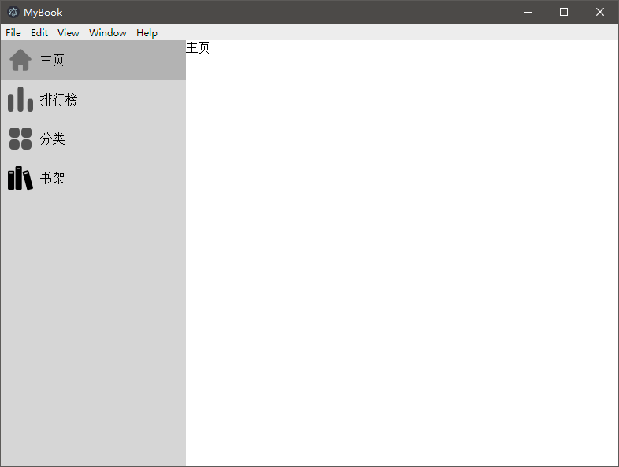
## 阅读界面
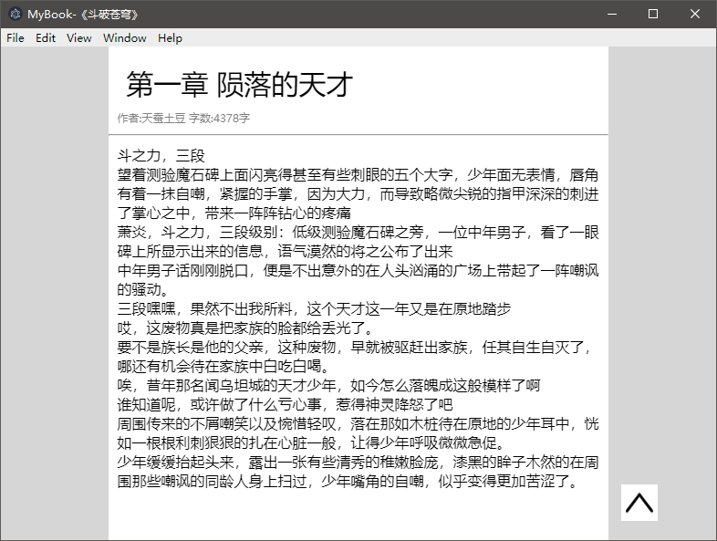

**注意**：现在只是雏形阶段，界面UI仅是设计思路，不代表最终效果。

## 本阅读器的特色与创新

1. 极简界面，文字部分几乎占满整个界面。
2. 秒开几百万字的小说，无需漫长的加载过程。
2. 采用electron框架，支持全平台。
3. 能够在网上免费下载书籍，和本地导入书籍。
4. 其他阅读器应该有的功能。

## 代码结构

前端UI设计 + 爬虫 + 数据库

### 前端UI设计

* 软件的交互，以及总体的设计
* 能够实现绚丽的界面效果

### 爬虫

* 能够根据书名爬取整本书
* 能够爬出推荐，排行榜，分类中的书籍名和书籍详细信息。

### 数据库

* 能够按照一定格式存储整本书，导入导出成txt
* 能有基本的字符串操作，将整本书拆分成章节，并提炼出目录。

## 日志

**[heroisuseless， 2019/8/7]**：为导出按钮添加逻辑功能，风格的列表vue双向绑定。
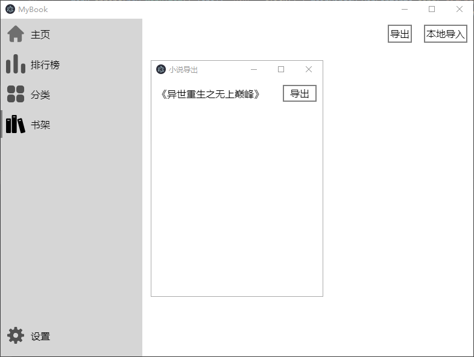
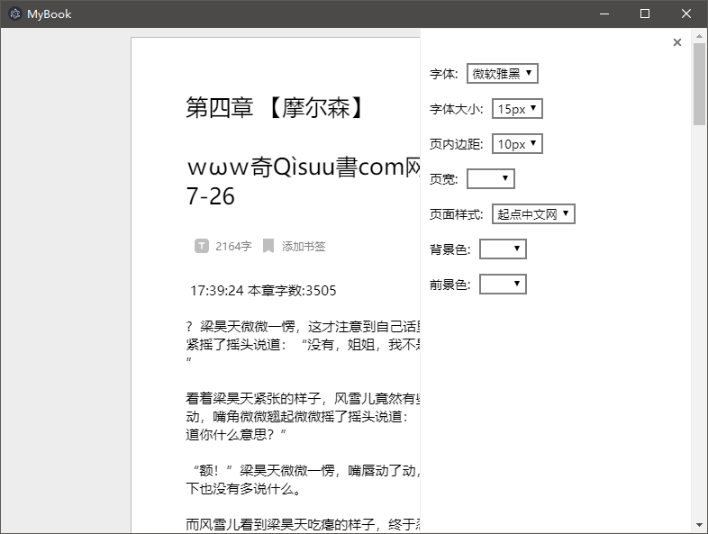

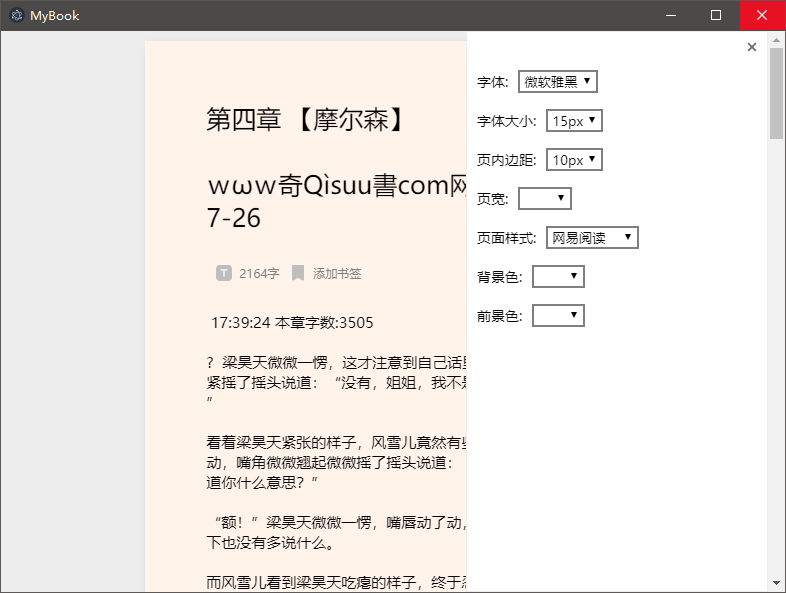
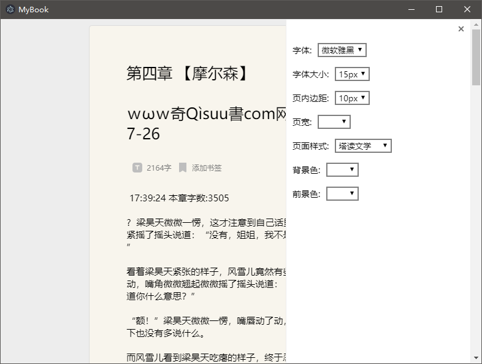
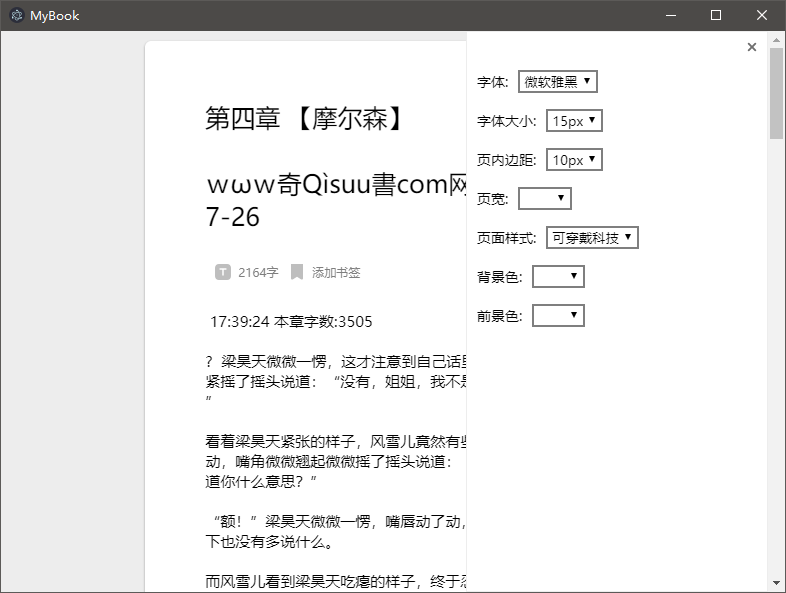

**[heroisuseless， 2019/8/6]**：加了一个导出按钮，做了一些风格css。

**[heroisuseless， 2019/8/5]**：添加设置窗口 

**[heroisuseless， 2019/8/4]**：添加目录，书签 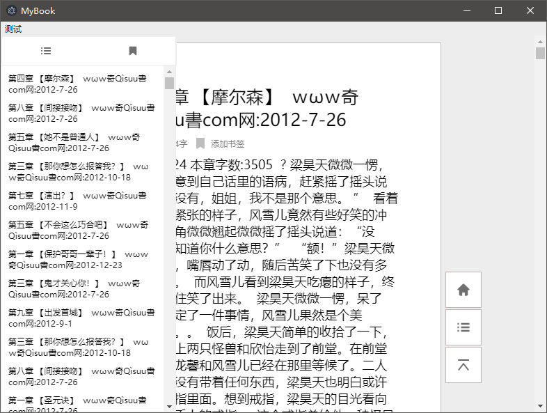

**[heroisuseless， 2019/8/3]**：添加数据库（nedb）和小说章节切割功能。

**[heroisuseless， 2019/8/2]**：主页面设计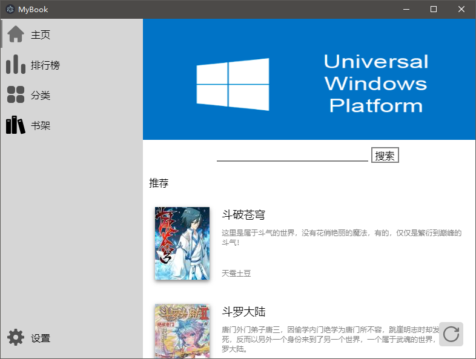

**[heroisuseless， 2019/8/1]**：分类页面设计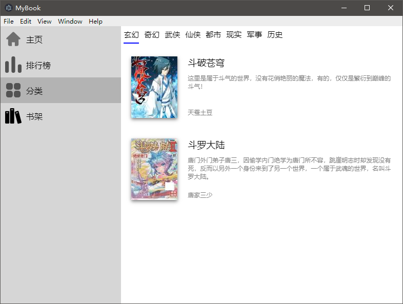

**[heroisuseless， 2019/8/1]**：书架页面设计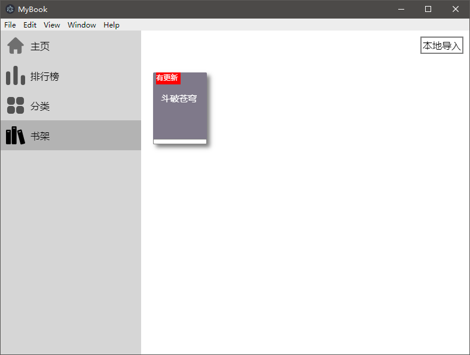

**[heroisuseless， 2019/8/1]**：美化阅读界面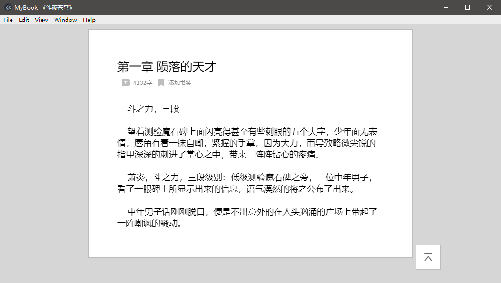

**[heroisuseless， 2019/7/31]**：项目启动啦！